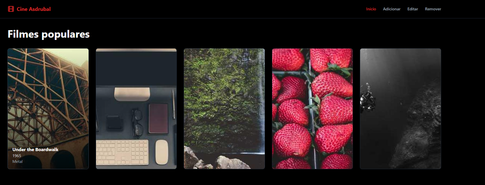

# Cine Asdrubal

Aplicação moderna de gerenciamento de filmes construída com React e TypeScript, apresentando uma bela interface com tema escuro e operações CRUD completas.

## Índice

- [Visão Geral](#visão-geral)
  - [Captura de Tela](#captura-de-tela)
  - [Funcionalidades Principais](#funcionalidades-principais)
  - [Tecnologias Utilizadas](#tecnologias-utilizadas)
  - [Detalhamento Técnico](#detalhamento-técnico)
- [Começando](#começando)
  - [Pré-requisitos](#pré-requisitos)
  - [Instalação](#instalação)

## Visão Geral

Cine Asdrubal é um sistema elegante de gerenciamento de filmes que permite aos usuários criar, ler, atualizar e excluir entradas de filmes com uma interface bonita e responsiva.

### Captura de Tela



### Funcionalidades Principais

- 🎬 Navegue pela coleção de filmes com layouts de cards bonitos
- 🔍 Pesquise filmes por ID
- ➕ Adicione novos filmes com validação de formulário
- ✏️ Edite detalhes de filmes existentes
- 🗑️ Exclua filmes com diálogo de confirmação
- 📱 Design totalmente responsivo
- 🌙 Interface otimizada com tema escuro

### Tecnologias Utilizadas

- ⚛️ **[React](https://react.dev/)** - Uma biblioteca JavaScript para construção de interfaces
- 🔷 **[TypeScript](https://www.typescriptlang.org/)** - JavaScript com sintaxe para tipos
- 🎨 **[Tailwind CSS](https://tailwindcss.com/)** - Framework CSS utilitário
- 🧩 **[shadcn/ui](https://ui.shadcn.com/)** - Componentes de UI reutilizáveis
- 📝 **[React Hook Form](https://react-hook-form.com/)** - Formulários com validação fácil de usar
- ✅ **[Zod](https://zod.dev/)** - Validação de esquemas com TypeScript
- ⚡ **[Vite](https://vitejs.dev/)** - Ferramentas de frontend de próxima geração
- 🎯 **[Lucide Icons](https://lucide.dev/)** - Ícones bonitos e consistentes

### Detalhamento Técnico

- **React + TypeScript**: A base da nossa aplicação, fornecendo segurança de tipos e melhor experiência de desenvolvimento.
  
- **Tailwind CSS**: Utilizado para desenvolvimento rápido de UI com classes utilitárias, garantindo design consistente e layouts responsivos.
  
- **shadcn/ui**: Fornece componentes acessíveis e personalizáveis que se integram perfeitamente com Tailwind CSS.
  
- **React Hook Form + Zod**: Gerencia nossos formulários com:
  - Validação de formulários com segurança de tipos
  - Gerenciamento eficiente de estado do formulário
  - Regras de validação baseadas em esquemas
  
- **Vite**: Oferece uma experiência de desenvolvimento ultra-rápida com recursos como:
  - Hot Module Replacement (HMR)
  - Builds otimizados
  - Suporte nativo ao TypeScript

## Começando

### Pré-requisitos

- Node.js (v18 ou superior)
- npm

### Instalação

1. Clone o repositório
```bash
git clone https://github.com/rickxz/cine-asdrubal.git
```

2. Instale as dependências
```bash
npm install
```

3. Inicie o servidor de desenvolvimento
```bash
npm run dev
```

A aplicação estará disponível em `http://localhost:5173`